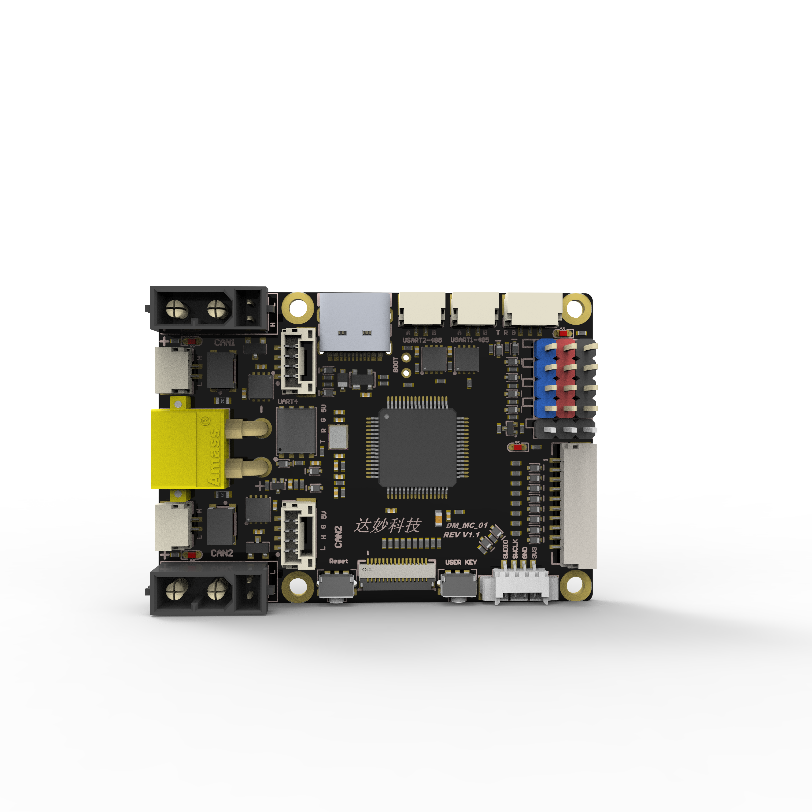

# 达妙科技 |DM-MC-Board01 电机开发板

#### 简介
DM-MC-Board01 主控芯片是STM32F446RCT6，该开发板是一款面向机器人控制的主控，具备防反接和缓启动等多重防护。配备了高性能IMU 模块（BMI088）以及1.69 寸240*280 分辨率的LCD 模块。该主控具备两个CAN 接口、两个高速RS485 接口、一个USB接口、SBUS、PWM 等丰富接口。可以配合达妙科技出品的关节电机、直驱电机等产品制作AGV 轮式机器人、平衡车、足式机器人、轮足等DIY 产品。

#### 特征参数

<table>
	<tr >
	    <td rowspan="3">结构参数
	    <td>供电电压</td>
	    <td>12~24v</td>
		<td></td>
    </tr>
	<tr>
	    <td>板载电源</td>
	    <td>5V/2A</td>
        <td>CAN2 & PWM</td>
	</tr>
	<tr>
	    <td>尺寸</td>
	    <td>56x40mm</td>
	</tr>
    	<tr >
	    <td rowspan="14">技术参数
	    <td>MCU</td>
	    <td>STM32F446RCT6</td>
		<td>256K Flash 128k RAM</td>
    </tr>
	<tr>
	    <td >可控电源</td>
	    <td>x2</td>
	    <td>PMOS（XT30 2+2）</td>
	</tr>
	<tr>
	    <td >CAN</td>
	    <td >x2</td>
	    <td >最大1Mbps</td>
	</tr>
	<tr>
	    <td >RS485</td>
	    <td >x2</td>
	    <td >最大10Mbps</td>
	</tr>
	<tr>
	    <td >USB</td>
	    <td >x1</td>
	    <td ></td>
	</tr>
    <tr>
	    <td >SBUS</td>
	    <td >x1</td>
	    <td ></td>
	</tr>
     <tr>
	    <td >PWM</td>
	    <td >x4</td>
	    <td ></td>
	</tr>
     <tr>
	    <td >串口</td>
	    <td >x2</td>
	    <td ></td>
	</tr>
    	</tr>
     <tr>
	    <td >SWD</td>
	    <td >x1</td>
	    <td ></td>
	</tr>
     <tr>
	    <td >LED</td>
	    <td >x4</td>
	    <td ></td>
	</tr>
     <tr>
	    <td >蜂鸣器</td>
	    <td >x1</td>
	    <td ></td>
	</tr>
     <tr>
	    <td >按键</td>
	    <td >x2</td>
	    <td ></td>
	</tr>
     <tr>
	    <td >IMU 扩展口</td>
	    <td >x1</td>
	    <td >SPI+IIC+PWM</td>
	</tr>
     <tr>
	    <td >LCD 扩展口</td>
	    <td >x1</td>
	    <td >SPI+IIC</td>
	</tr>
<table>

#### 配套例程

* [0.LED例程](LED)
* [1.KEY按键例程](Key_exit)
* [2.ADC例程](ADC)
* [3.PWM例程](PWM)
* [4.RS485例程](RS485)
* [5.UART例程](UART5)
* [6.USB-CDC例程](USB-CDC)
* [7.CAN例程](Key_exit)
* [8.LCD显示屏例程](LCD)
* [9.BMI088数据读取例程](IMU-BMI088)
* [10.IMU-RTOS](IMU-RTOS)
* [11.Standard Board](AllInOne)

